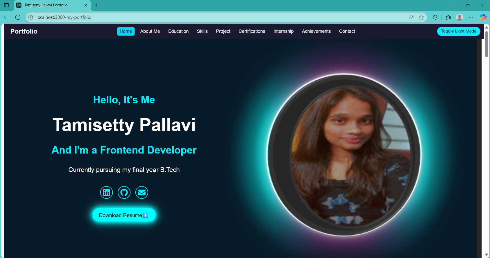
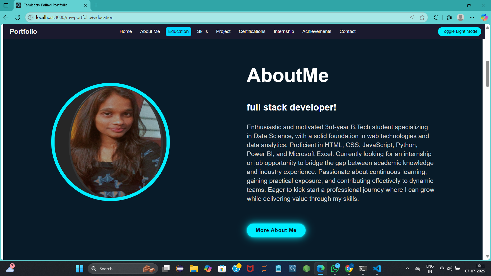
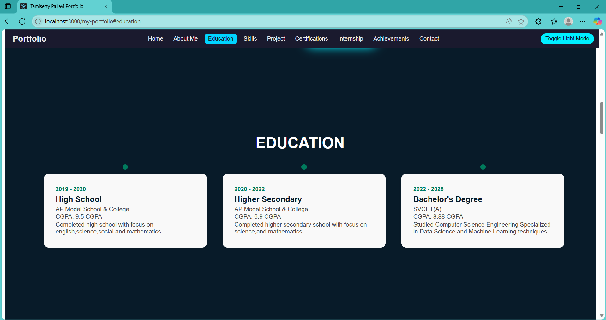
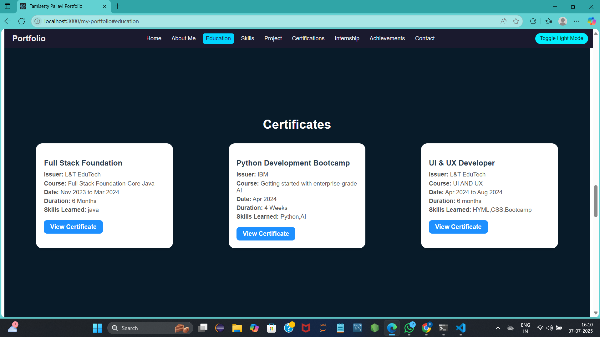
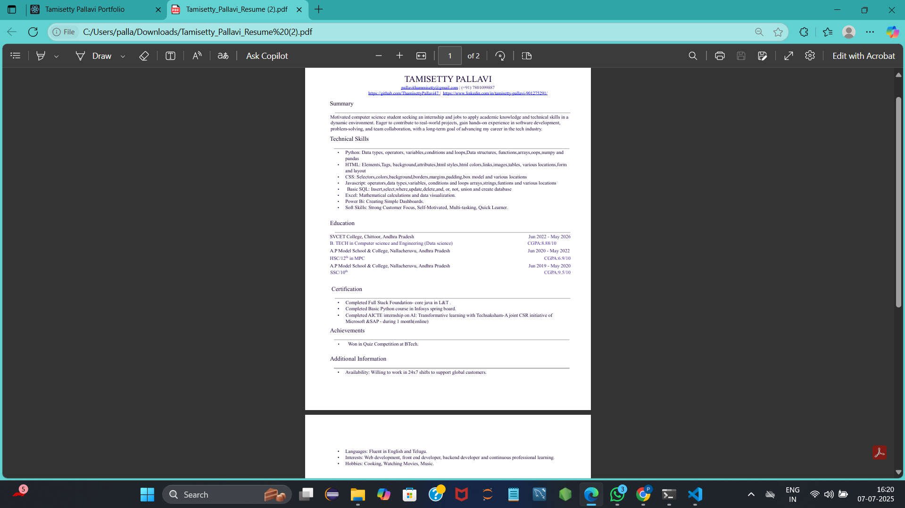

# 💼 My React.js Portfolio – Tamisetty Pallavi

Welcome to my personal portfolio website developed using React.js!  
It showcases my **projects**, **certificates**, **skills**, **education**, and includes features like responsive UI, animations, and downloadable resume support.

---

## 🌐 Live Demo

🚀 **Hosted on GitHub Pages:**  
🔗 [https://thamisettypallavi47.github.io/my-portfolio/](https://thamisettypallavi47.github.io/my-portfolio/)

---

## ✨ Features

- 🔄 **Responsive Design** — Fully mobile-friendly layout using CSS media queries.
- ✨ **Framer Motion Animations** — Smooth entrance/scroll effects on all sections.
- 🎓 **Education Timeline** — Horizontally displayed on desktop, vertically on mobile.
- 📂 **Certificates Section** — Lists 3-4 key certificates with course details and "View Certificate" buttons (opens image or PDF).
- 🧰 **Skills Section** — 
  - **Technical Skills** with animated progress bars  
  - **Professional Skills** with circular radial bars
- 📜 **Resume Download** — A direct button that downloads your resume as a PDF.
- 📧 **EmailJS Integration (No Backend Needed)** — Contact form sends emails directly using EmailJS, no server setup required
- 📁 **Deployed on GitHub Pages** — Fast and serverless hosting with live updates.
- 📱 **Mobile Navigation Auto-Close** — When a nav item is clicked on mobile view, the menu automatically closes (great for user experience!).
- 🧭 **Section Scroll Navigation** — Clicking nav items scrolls to specific sections using HTML IDs.

---

## 📸 Screenshots

> Store these images in a `/screenshots/` folder inside your root project and update if needed.

### 🏠 Home Page


### 🏠 Aboutme Page


### 🎓 Education Timeline


### 📜 Certificates


### 📥 Resume Download Button


---

## 🛠️ Technologies Used

| Category             | Tools/Technologies                     |
|----------------------|----------------------------------------|
| **Frontend Framework** | React.js (with JSX + functional components) |
| **Animations**       | Framer Motion                          |
| **Icons**            | React Icons                            |
| **Version Control**  | Git + GitHub                           |
| **Deployment**       | GitHub Pages                           |
| **Styling**          | HTML5, CSS3, Media Queries             |
| **Assets**           | Images and PDFs placed inside `public/` folder |

---

## 🧪 Run Locally (Development)

```bash
# 1. Clone the repo
git clone https://github.com/ThamisettyPallavi47/my-portfolio.git

# 2. Navigate to the project directory
cd my-portfolio

# 3. Install required dependencies
npm install

# 4. Start the local development server
npm start
```

## 🚀 Deploying to GitHub Pages
1. Install `gh-pages` (if you haven’t already):  

```bash
npm install gh-pages --save-dev
```
2.Update your package.json file:

```json
"homepage": "https://ThamisettyPallavi47.github.io/my-portfolio",
```
```json
"scripts": {
  "predeploy": "npm run build",
  "deploy": "gh-pages -d build"
  
}

```

3.Build and deploy your app:

```bash
  npm run build
  npm run deploy
```


## 📫 Contact

- Email: pallavithammisetty@gmail.com  
- LinkedIn: [Pallavi Thamisetty](https://linkedin.com/in/pallavithammisetty)  
- GitHub: [ThamisettyPallavi47](https://github.com/ThamisettyPallavi47)


